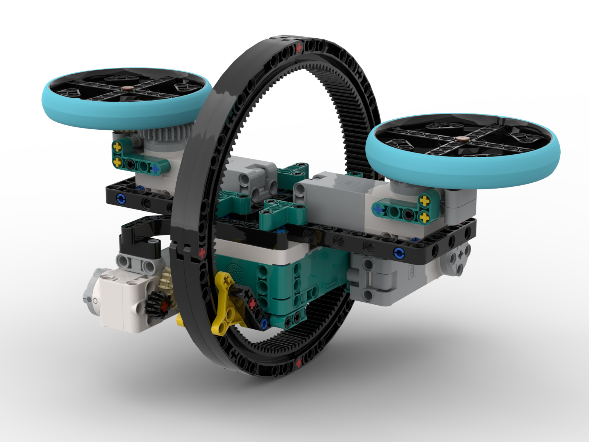
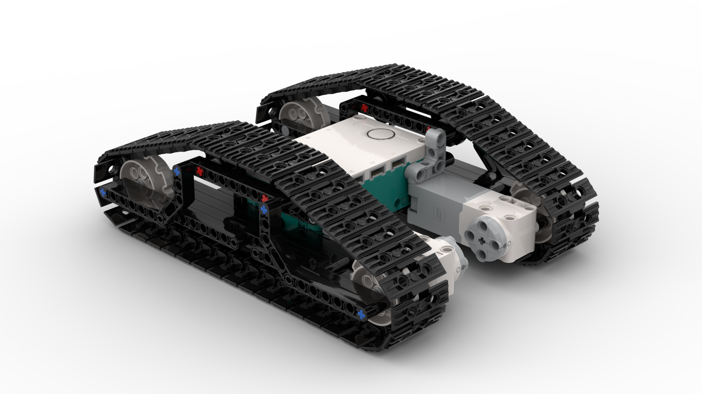
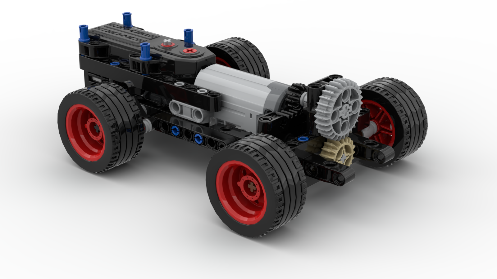

# Lego Projects

Mainly build with LEGO Mindstorms Robot Inventor (or Spike Prime) and additional parts.  
You can explore the models by downloading the `.io` files and open with [Studio 2.0](https://www.bricklink.com/v3/studio/download.page).  
Programming is done via [Mindstrom App](https://www.microsoft.com/en-us/p/lego-mindstorms-robot-inventor/9mtq0n7w1d6x) (`.lms` files).

## Monowheel
 
[Monowheel.io](Monowheel/Monowheel.io)  
[Monowheel.lms](Monowheel/Monowheel.lms)  
[YouTube](https://youtu.be/LSGNU25Ck0g)

## Caterpillar
 
[Caterpillar.io](Caterpillar/Caterpillar.io)  
[Caterpillar.lms](Caterpillar/Caterpillar.lms)  

## Compact Chassis
 
[compact_chassis.io](CompactChassis/compact_chassis.io)  
